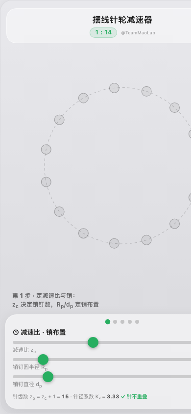

# 摆线针轮减速器 · 原理演示（小红书小工具）

**v7 浅灰玻璃风**的 2D 运转演示小工具：把"偏心公转是输入、被针齿逼出的自转是输出"讲清楚。
纯离线 H5，符合小红书小工具容器规范，zip 直接上传。

## 预览



## 功能

- **5 阶段分步设计**：控制面板**左右滑动**（鼠标拖拽 + 触屏滑动 + 滚轮），一屏一阶段，画布与面板联动
  - ① 减速比·销布置 → ② 摆线生成 → ③ 啮合修形 → ④ W 机构 → ⑤ 运转验证
- **阶段 1-3 不啮合**（静态设计视图），④⑤ 才偏心啮合 + 运转
- **① 减速比·销布置**：3 参数（zc / Rp / **销钉直径 dp**），画布只画**虚线圆 + 销钉**（无摆线），K₂ 校验针不重叠
- **② 摆线生成**：1 参数（**短幅系数 K₁**，e = K₁·Rp/zp 派生）+ **「▶ 生成摆线」滚圆滚动动画**（滚圆贴基圆滚，笔尖画出摆线，符合物理）
  - 滚圆 = 销钉圆派生的**细实线绿色小圆**（b=Rp/zp），内部**黄色小点**为滚动标记（短幅，e<b）
  - **拖 K₁ 滑块自动放大聚焦滚圆**，松手恢复（黄点太小，聚焦后才能看清偏心距）
- **③ 啮合修形**：1 参数（drp），画布切到**啮合静态位**（偏心 +e），看齿面与针齿间隙 = drp
- **④ W 机构**：nW / rw / Rw，孔随盘公转、销只慢转
- **⑤ 运转验证**：双表盘 + 圈数 + 演示 zc 圈自动停（输入 zc 圈 = 输出 1 圈）

## 原理（一句话）

摆线轮齿数 z<sub>c</sub> 对针齿 z<sub>p</sub> = z<sub>c</sub>+1，齿数差 1 = 减速来源。
偏心套让摆线轮**公转**（输入），针齿逼出**反向自转** = −φ/z<sub>c</sub>（输出）。

## 设计语言

**v7 浅灰玻璃风**（移植自 mdog/v7_mobile 四足机器狗手机版）：浅灰渐变底 + 玻璃拟态浮空卡片 + 绿色渐变主调，iOS 毛玻璃科技感、轻盈现代。

| 元素 | 处理 |
|---|---|
| 底 | `#e8e8ec → #d8d8dc` 浅灰渐变，全屏 2D 视口 |
| 标题栏 | 浮顶玻璃 `rgba(255,255,255,.45)` + `blur(16px)`，绿色减速比徽章 |
| 控制卡 | 底部浮空玻璃 `rgba(255,255,255,.55)` + `blur(20px)`，圆角 18px |
| 摆线轮 | `#27ae60` 绿（同主按钮渐变 `#27ae60→#2ecc71`） |
| W 销/输出 | `#e67e22` 橙，输入辐条 `#4a9eff` 蓝，基准线 `#ff6b6b` 红 |
| 圈数读数 | 绿色大号 `tabular-nums`，运转时不跳动 |
| 滑块 | 细轨 + 绿色圆拇指（22px，触摸友好） |
| 参数 | 玻璃卡内嵌折叠区，K₁ 超界橙/红分级警告 |

## 开发

```bash
npm run build   # src → dist
npm run pack    # dist → cycloidal_cycloid.zip + 自检（index 在根 / 无内联脚本 / 白名单 / 体积）
```

产物：`cycloidal_cycloid.zip`（约 8KB，远小于 2MB 建议值）

## 结构

```
cycloidal_toolkit/
├── src/
│   ├── index.html    # 入口（脚本外置，viewport-fit=cover + 安全区）
│   ├── style.css     # v7 浅灰玻璃风视觉系统
│   └── main.js       # 运转演示 + 参数化（数学移植自 archive demo）
├── tools/
│   ├── build.js      # 拷贝构建（零依赖）
│   └── pack.js       # 打 zip + 规范自检
├── docs/preview.png  # 预览截图
├── dist/             # 构建产物
└── archive/          # 桌面端历史版本（分步设计器 / 单齿廓 / 1:10 演示 / 整机脚本）
    └── cycloidal_reduction_demo.html  ← 数学来源
```

## 合规要点

- 无内联 `<script>` / 无 `onclick=` / 无 `eval` / `new Function` / 无 fetch
- 无外部资源（字体、图片、CDN 全无）；背景噪点用内嵌 SVG `data:` URI
- `index.html` 在 zip 根目录；文件类型仅 `.html/.css/.js`
- `npm run pack` 自带规范自检，全绿才交付

## 参数速查（全部可调）

| 参数 | 默认 | 范围 | 阶段 | 说明 |
|------|------|------|------|------|
| zc | 14 | 5~30 | ① | 摆线齿数，减速比 = 1:zc，zp = zc+1 |
| Rp | 20mm | 20~60 | ① | 销钉分布圆半径（定总尺寸），K₂ 校验 |
| dp | 3mm | 1~8 | ① | **销钉直径**（购买规格），rp = dp/2 |
| k1 | 0.75 | 0.2~0.95 | ② | **短幅系数**（定曲线类型），e = k1·Rp/zp 派生 |
| drp | 0.2mm | 0~1.5 | ③ | 齿侧间隙（修形量） |
| nW | 8 | 4~12 | ④ | W 机构销数 |
| dw | 3mm | 1~8 | ④ | **W 销直径**（购买规格） |
| Rw | 20mm | 12~30 | ④ | W 销分布圆半径 |
| speed | 1 | 0.2~8 | ⑤ | 运转速度 |
